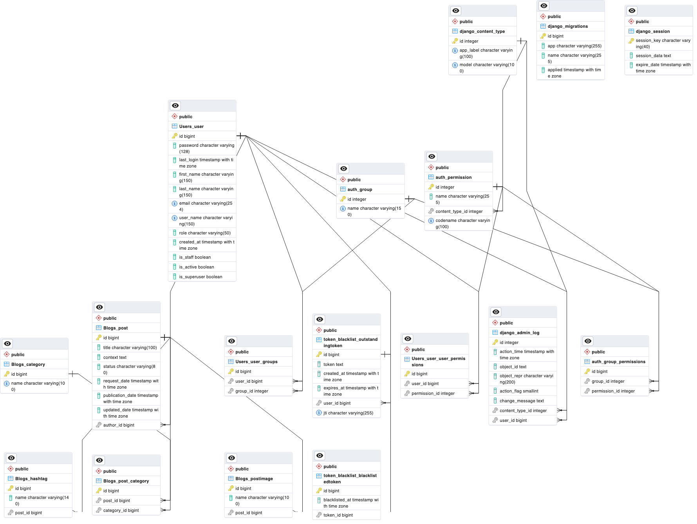

# Blogs-API-drf

The application aims to create REST APIs that will fulfill the functionality of the blog website using Django and Django Rest Framework.
The application is run along with git@github.com:LianaSmile/Blogs-API-drf.git.

## Installation

First install the application NOTIFIER and run it.

```bash
git clone git@github.com:LianaSmile/NOTIFIER.git
cd NOTIFIER
docker build --tag notifier .
docker run -p 127.0.0.1:80:8080/tcp notifier
```

Next install Blogs-API-drf.

```bash
git clone git@github.com:LianaSmile/Blogs-API-drf.git
cd BlogsWebsiteBackend
python3 -m venv venv
source venv/bin/activate
pip install -r requirements/requirements.txt
python manage.py makemigrations
python manage.py migrate
python manage.py runserver
```

## Usage
For usage direct to:
1. http://127.0.0.1:8000/swagger/
2. http://127.0.0.1:8000/redoc/


## Running Tests
The following tests can be run From BlogsWebsiteBackend folder.

**Note: To run the tests comment the first "default" and uncomment the second one in the settings.py file to use sqlite3 as it is faster.

```
DATABASES = {
    'default': {
        'ENGINE': 'django.db.backends.postgresql_psycopg2',
        'NAME': env("DB_NAME"),
        'USER': env("DB_USER"),
        'PASSWORD': env("DB_PASSWORD"),
        'HOST': env("DB_HOST"),
        'PORT': env("DB_PORT"),
    },
    # 'default': {
    #     'ENGINE': 'django.db.backends.sqlite3',
    #     'NAME': BASE_DIR / 'db.sqlite3',
    # }
}
```

1. For Authentication app

```bash
python manage.py test Authentication.tests.test_urls 
python manage.py test Authentication.tests.test_views
```

2. For Blogs app

```bash
python manage.py test Blogs.tests.test_models
python manage.py test Blogs.tests.test_urls
python manage.py test Blogs.tests.test_views
```

3. For Users app

```bash
python manage.py test Users.tests.test_managers
python manage.py test Users.tests.test_models
python manage.py test Users.tests.test_urls
python manage.py test Users.tests.test_views
```

## Logging

All the logs are saved in information.log file.

## Database relational diagram



## Status
Always can be improved :)
